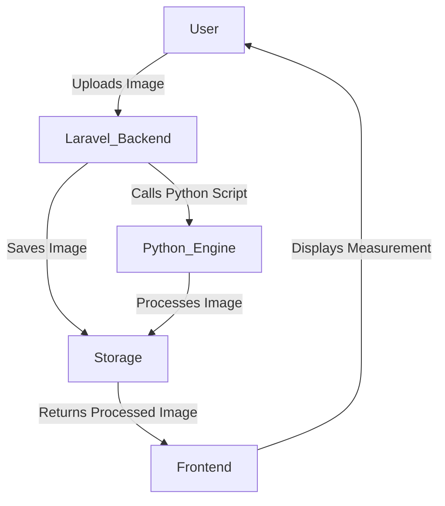
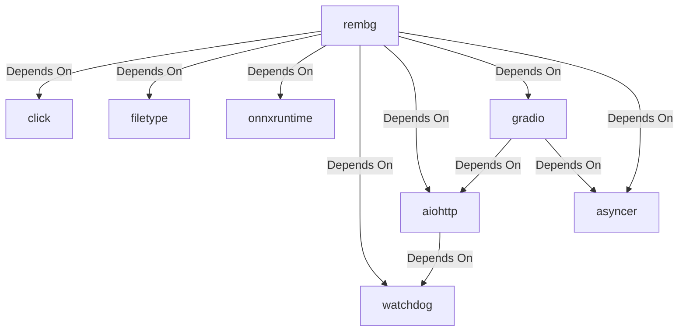

# Calliper Measurement System Documentation

## Overview
The Calliper Measurement System is a web-based tool that allows users to upload an image of a bead, measure its size using a digital caliper interface, and apply image processing techniques to enhance the visibility of the bead.

---

## Tools & Technologies Used

### Frontend
- HTML
- CSS (Custom styles)
- JavaScript (Basic interactivity)
- Laravel Blade Templates

### Backend
- Laravel 12.2.0 (PHP Framework)
- Python 3.13 (For Image Processing)
- ImageMagick (For Image Manipulation)
- Rembg (For Background Removal)

---

## Key Functionalities

### 1. Uploading Image
- Users can upload an image of a bead.
- The image is stored in the `/public/misc/certificate/nepa-rudraksha/beads/` directory.

### 2. Processing Image
- The backend calls a Python script to process the image.
- Rembg is used to remove the background.
- ImageMagick (`convert`) is used to trim the image.

### 3. Displaying Measurement
- The processed image is displayed on the frontend.
- A digital caliper interface is used to represent the measurement.

---

## Local Installation & Setup

### 1. Install Laravel
```bash
composer install
```
 
## 2.Imagick Command For windows local machine
 ```php
  $command = "magik convert \"{$imagePath}\" -trim \"{$outputFilePath}\" 2>&1";
  ```

### 3. Install Python Dependencies
Install the required Python dependencies for running `rembg`:
```bash
pip install click filetype rembg onnxruntime watchdog aiohttp gradio asyncer
```

### 4. Install ImageMagick
- Download and install from [https://imagemagick.org](https://imagemagick.org).
- Download dll files from [https://pecl.php.net/package/imagick/3.8.0RC2/windows](https://pecl.php.net/package/imagick/3.8.0RC2/windows) (PHP version specific).
- Copy the dll files below to your php directory  
    - CORE_RL_*.dll (core files)
    - IM_MOD_RL_*.dll (module files)

- Copy the dll file below to your php/ext directory
    - php_imagick.dll (extension file)

- In your php/php.ini file copy the line below
    - extension=php_imagick.dll


### 5. Full Path Requirement for `rembg`
- When using `rembg` in Laravel, ensure that the **full path** to the `rembg` executable is specified in the code.
- Example:
    ```php
    $rembgPath = '/full/path/to/rembg.py'; 
    $rembgPath = str_replace('\\', '/', $rembgPath);
    $command = "\"{$rembgPath}\" i \"{$imagePath}\" \"{$outputFilePath}\"";
    ```
- Replace `/full/path/to/rembg.py` with the actual path where `rembg.py` is located on your system.
- To find the rembg.exe file path on local machine
```bash
where rembg
```

---

## Server Installation and Setup

## 1.Configure Predefined Commands
- ## Install Command
```bash
apt-get update && apt-get install -y imagemagick && apt-get update && apt-get install -y imagemagick python3 python3-pip && pip3 install rembg onnxruntime && pip3 install click filetype rembg onnxruntime watchdog aiohttp gradio asyncer
```

- ## Build Command
```bash
composer install --no-interaction --prefer-dist --optimize-autoloader && php artisan migrate --force && php artisan config:cache && chmod -R 775 public/misc && chown -R www-data:www-data public/misc
```

- ## Start Command
```bash
php artisan serve --host=0.0.0.0 --port=$PORT
```

## 2.CalliperBackgroundRemoveService Command For Server/linux
 ```php
  $command = "convert \"{$imagePath}\" -trim \"{$outputFilePath}\" 2>&1";
  ```
## 3.rembg Command For Server/linux
- Note that in local machine the parth for rembg.exe will be different from while executing in server so while deploying the code change rembg path.
- Command to check rembg path in server:
```bash
which rembg
```


## Dependencies and Their Purpose

### 1. Laravel
- Used as the backend framework for handling requests, routing, and business logic.

### 2. Python Dependencies
- **rembg**: The main package for background removal.
- **click**: For creating command-line interfaces.
- **filetype**: To determine the type of files being processed.
- **onnxruntime**: Provides runtime support for ONNX models used in image processing.
- **watchdog**: Monitors file system changes for real-time updates.
- **aiohttp**: An asynchronous HTTP client/server framework.
- **gradio**: For creating user interfaces for machine learning models.
- **asyncer**: Simplifies asynchronous programming in Python.

### 3. ImageMagick
- Used for image manipulation, such as trimming and resizing.

---

## Workflow Overview



---

## Package Dependencies Diagram

The following diagram illustrates the main packages used in the system and their dependencies:



---

## Code Changes

### 1. Laravel Controller (CalliperController.php)
- Handles image uploads.
- Calls Python scripts for processing.

### 2. Frontend (Blade Template)
- Updated CSS for better UI.
- Added functionality to capture the image of the caliper.

### 3. Python Script
- Uses `rembg` for background removal.
- Uses `convert` (ImageMagick) for image trimming.

---

## Future Improvements
- Add user authentication.
- Improve measurement accuracy.
- Allow export of measurements as a report.
