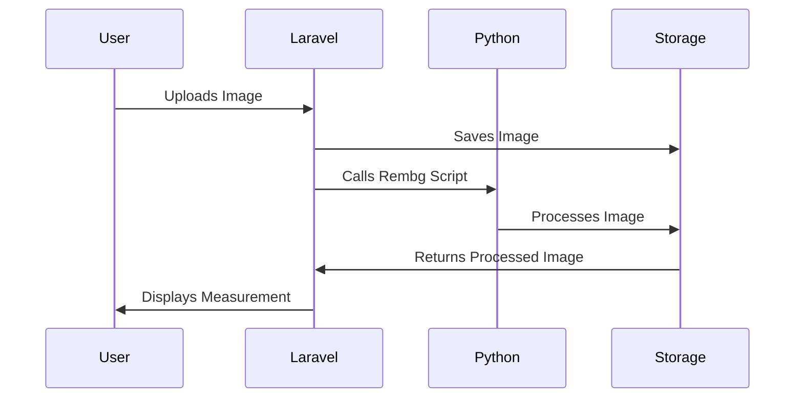

# Calliper Measurement System Documentation

## Overview
The Calliper Measurement System is a web-based tool that allows users to upload an image of a bead, measure its size using a digital caliper interface, and apply image processing techniques to enhance the visibility of the bead.

## Tools & Technologies Used

### Frontend
- HTML
- CSS (Custom styles)
- JavaScript (Basic interactivity)
- Laravel Blade Templates

### Backend
- Laravel 12.2.0 (PHP Framework)
- Python 3.13 (For Image Processing)
- ImageMagick (For Image Manipulation)
- Rembg (For Background Removal)

## Workflow Overview
```mermaid
graph TD;
    User -->|Uploads Image| Laravel Backend;
    Laravel Backend -->|Saves Image| Storage;
    Laravel Backend -->|Calls Python Script| Python Engine;
    Python Engine -->|Processes Image| Storage;
    Storage -->|Returns Processed Image| Frontend;
    Frontend -->|Displays Measurement| User;
```

## Key Functionalities

### 1. Uploading Image
- Users can upload an image of a bead.
- The image is stored in the `/public/misc/certificate/nepa-rudraksha/beads/` directory.

### 2. Processing Image
- The backend calls a Python script to process the image.
- Rembg is used to remove the background.
- ImageMagick (`convert`) is used to trim the image.

### 3. Displaying Measurement
- The processed image is displayed on the frontend.
- A digital caliper interface is used to represent the measurement.

## Installation & Setup

### 1. Install Dependencies
```bash
# Install Laravel
composer install

# Install Python dependencies
pip install rembg
pip install pillow
pip install imageio
```

### 2. Install ImageMagick
- Download from [https://imagemagick.org](https://imagemagick.org)
- Add `convert` to system path.

## Code Changes

### 1. Laravel Controller (CalliperController.php)
- Handles image uploads.
- Calls Python scripts for processing.

### 2. Frontend (Blade Template)
- Updated CSS for better UI.
- Added functionality to capture the image of the caliper.

### 3. Python Script
- Uses `rembg` for background removal.
- Uses `convert` (ImageMagick) for image trimming.

## Diagram: Laravel-Python Integration


## Future Improvements
- Add user authentication.
- Improve measurement accuracy.
- Allow export of measurements as a report.
