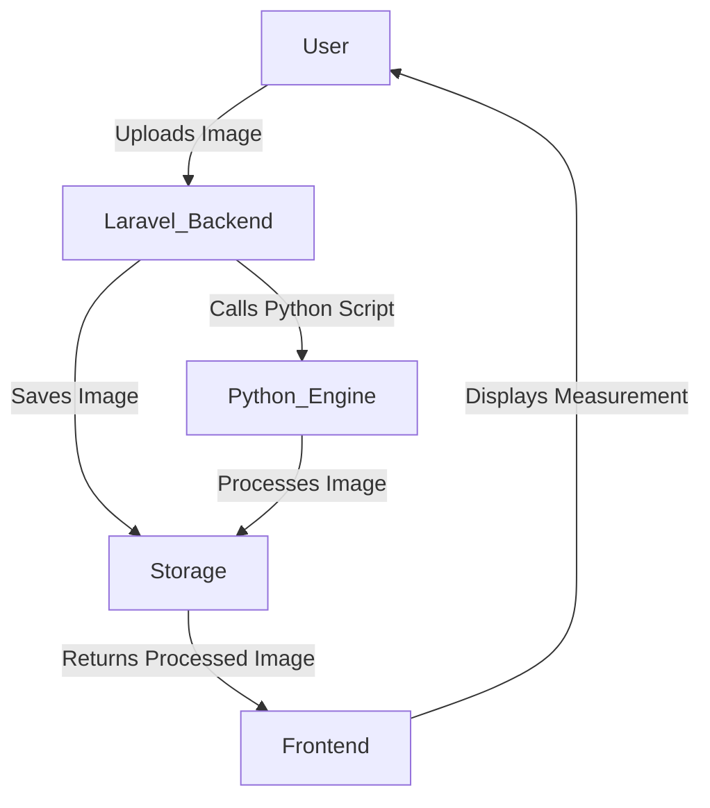
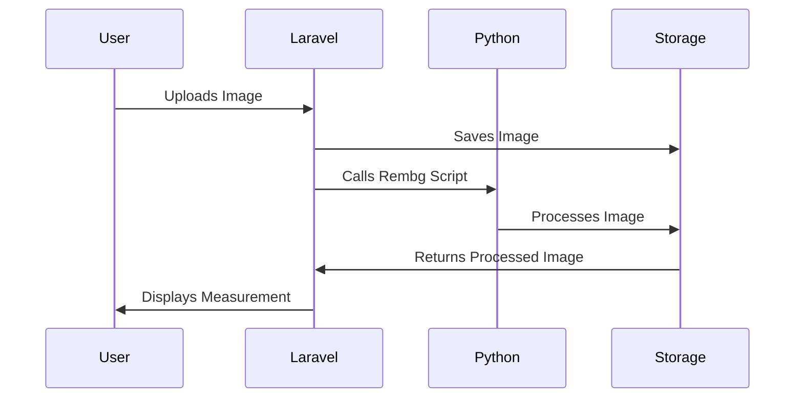

# Calliper Measurement System Documentation

## Overview
The Calliper Measurement System is a web-based tool that allows users to upload an image of a bead, measure its size using a digital caliper interface, and apply image processing techniques to enhance the visibility of the bead.

## Tools & Technologies Used

### Frontend
- HTML
- CSS (Custom styles)
- JavaScript (Basic interactivity)
- Laravel Blade Templates

### Backend
- Laravel 12.2.0 (PHP Framework)
- Python 3.13 (For Image Processing)
- ImageMagick (For Image Manipulation)
- Rembg (For Background Removal)

## Workflow Overview


## Key Functionalities

### 1. Uploading Image
- Users can upload an image of a bead.
- The image is stored in the `/public/misc/certificate/nepa-rudraksha/beads/` directory.

### 2. Processing Image
- The backend calls a Python script to process the image.
- Rembg is used to remove the background.
- ImageMagick (`convert`) is used to trim the image.

### 3. Displaying Measurement
- The processed image is displayed on the frontend.
- A digital caliper interface is used to represent the measurement.

## Steps to Install ImageMagick

Follow these steps to install ImageMagick on your system:

### 1. Download ImageMagick
- Visit the official ImageMagick website: [https://imagemagick.org](https://imagemagick.org).
- Download the appropriate version for your operating system (Windows, macOS, or Linux).

### 2. Install ImageMagick
- Run the installer and follow the on-screen instructions.
- During installation, ensure the following options are selected:
  - Add application directory to your system path.
  - Install legacy utilities (e.g., `convert`).

### 3. Download DLL Files
- Visit [https://pecl.php.net/package/imagick/3.8.0RC2/windows](https://pecl.php.net/package/imagick/3.8.0RC2/windows).
- Download the DLL zip file for your PHP version.

### 4. Copy DLL Files
- Extract the downloaded zip file.
- Copy all `CORE*.dll` and `IM_MOD*.dll` files to your PHP installation directory (e.g., `C:\php`).
- Copy the `php_imagick.dll` file to the `ext` directory inside your PHP installation (e.g., `C:\php\ext`).

### 5. Enable the PHP Extension
- Open your `php.ini` file.
- Add the following line to enable the `imagick` extension:
    ```ini
    extension=php_imagick.dll
    ```

### 6. Verify Installation
- Restart your web server (e.g., Apache or Nginx).
- Run the following command to verify that the `imagick` extension is enabled:
    ```bash
    php -m | findstr imagick
    ```
- You should see `imagick` listed in the output.

### 7. Test ImageMagick
- Test ImageMagick by running a simple command:
    ```bash
    convert input.jpg -resize 50% output.jpg
    ```
- Replace `input.jpg` with the path to an image file on your system. This command resizes the image to 50% of its original size.

## Installation & Setup

### 1. Install Dependencies
```bash
# Install Laravel
composer install

# Install Python dependencies
pip3 install click filetype rembg onnxruntime watchdog aiohttp gradio asyncer
```

### 2. Install ImageMagick
- Follow the steps outlined in the [Steps to Install ImageMagick](#steps-to-install-imagemagick) section.

### 3. Full Path Requirement for `rembg`
- When using `rembg` in Laravel, ensure that the **full path** to the `rembg` executable is specified in the code.
- Example:
    ```php
    $rembgPath = '/full/path/to/rembg.py'; 
      $rembgPath = str_replace('\\', '/', $rembgPath);
    $command = "\"{$rembgPath}\" i \"{$imagePath}\" \"{$outputFilePath}\"";
    ```
- Replace `/full/path/to/rembg.py` with the actual path where `rembg.py` is located on your system.

## Code Changes

### 1. Laravel Controller (CalliperController.php)
- Handles image uploads.
- Calls Python scripts for processing.

### 2. Frontend (Blade Template)
- Updated CSS for better UI.
- Added functionality to capture the image of the caliper.

### 3. Python Script
- Uses `rembg` for background removal.
- Uses `convert` (ImageMagick) for image trimming.

## Diagram: Laravel-Python Integration


## Future Improvements
- Add user authentication.
- Improve measurement accuracy.
- Allow export of measurements as a report.
